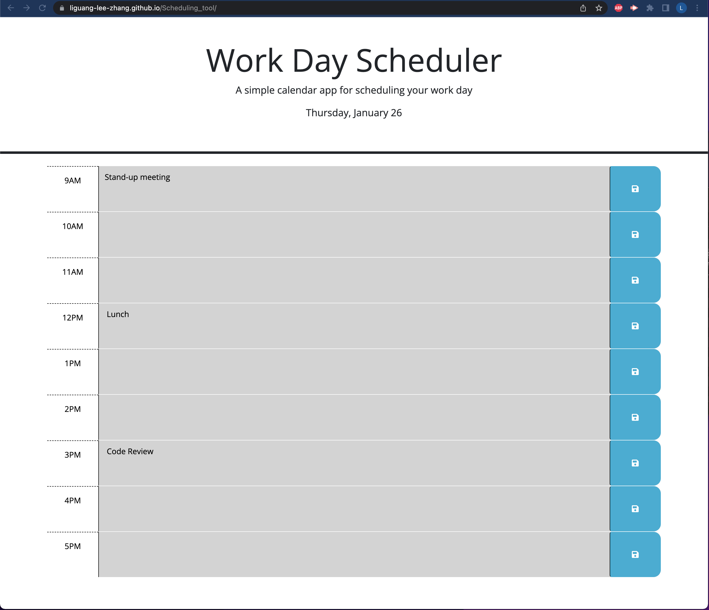

# Password_generator

## Description

Provide a short description explaining the what, why, and how of your project. Use the following questions as a guide:

As employees often have busy schedules, it becomes difficult to stay on top of the various work tasks. A daily planner which allows the user to enter and store scheduled to-dos as well as visually displaying the current date would enable employees to keep track of their work tasks, allowing them to be more efficient at work. 

This webapplication uses web API and third-party APIs including Jquery, Bootstrap. 

## Installation

Use any web browser to access the webpage. If you wish to see the source code, please the clone the github repo to your computer and edit using any IDE for html, css and javascript. 

## Usage

To access the webpage, go to https://liguang-lee-zhang.github.io/Scheduling_tool/. 

Image showing deployed webpage:

## License

This project is under a MIT license. 

